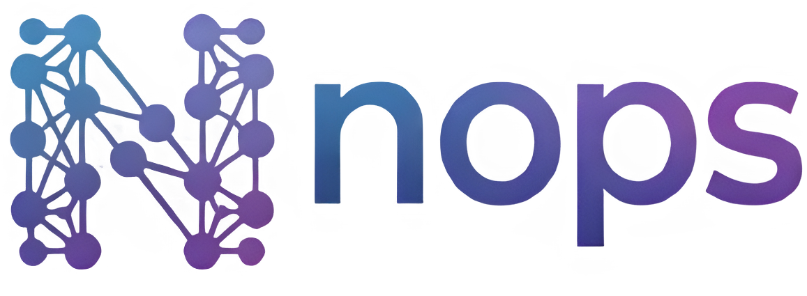
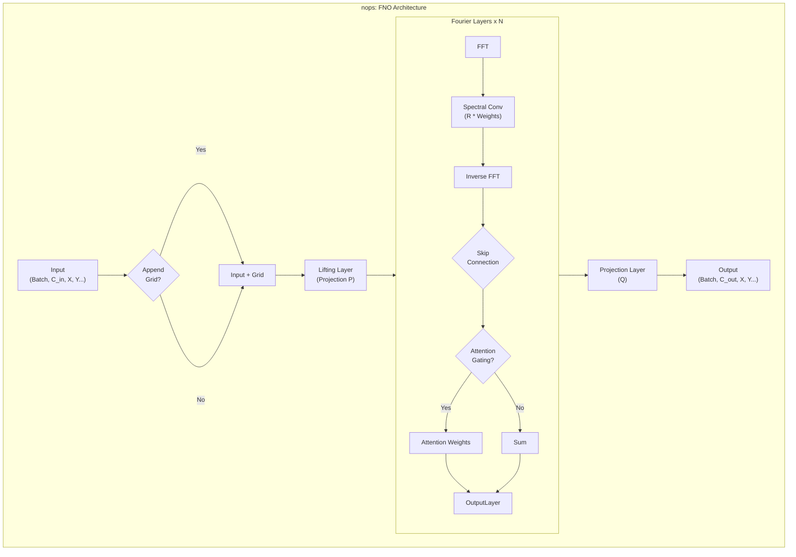

<div align="center">

</div>

<div align="center">

**Neural Operators made simple.**

[](https://badge.fury.io/py/nops)
[](https://pypi.org/project/nops/)
[](https://opensource.org/licenses/MIT)
[](https://github.com/psf/black)



*A human-centric interface for operating with Neural Operators (FNO, GNO, DeepONet, etc.).*

</div>

---

**nops** is designed to be an elegant, high-level layer over complex neural operator architectures. Whether you are a researcher prototyping a new PDE solver or an engineer deploying a model to production, `nops` abstracts the complexity while retaining the flexibility you need.

## ✨ Features

*   **Human-Friendly API:** Intuitive classes and methods that make sense.
*   **Multi-Dimensional:** Seamless support for 1D, 2D, and 3D FNO models.
*   **Production Ready:** Built with modularity, type hinting, and efficiency in mind.
*   **Batteries Included:**
    *   **Attention Gating:** Advanced mechanisms to weight parallel Fourier branches.
    *   **Flexible Gridding:** Automatic handling of grid coordinates.
    *   **Padding Management:** Easy handling of boundary conditions.

## 📦 Installation

Install `nops` easily via pip:

```bash
pip install nops
```

*Note: Requires Python 3.12+*

## 🚀 Quick Start

Solving a PDE with a Fourier Neural Operator (FNO) has never been this simple.

```python
import torch
import torch.nn as nn
from nops.fno.models.original import FNO

# 1. Define your configuration
model = FNO(
    modes=[16, 16],               # 16 Fourier modes for height and width
    num_fourier_layers=4,         # Depth of the network
    in_channels=3,                # (e.g., u, v, p)
    out_channels=1,               # (e.g., pressure field)
    lifting_channels=64,
    projection_channels=64,
    mid_channels=64,
    activation=nn.GELU(),
    add_grid=True,                # Auto-append x,y coordinates
    attn_gating=True              # Enable attention mechanism
)

# 2. Forward pass
# Batch size: 8, Channels: 3, Resolution: 128x128
input_data = torch.randn(8, 3, 128, 128)
output = model(input_data)

print(f"Output Field Shape: {output.shape}")
# > Output Field Shape: torch.Size([8, 1, 128, 128])
```

## 🗺️ Roadmap

- [x] **FNO (Fourier Neural Operator):** Original implementation with attention extensions.
- [ ] **DeepONet:** Implementation of Deep Operator Networks.
- [ ] **GNO (Graph Neural Operator):** Support for irregular meshes.
- [ ] **Physics-Informed Losses:** Built-in loss functions for PDE constraints.
- [ ] **Data Loaders:** Standard datasets (Burgers, Navier-Stokes, Darcy Flow).

## 🤝 Contributing

We welcome contributions! `nops` is a community-driven project to make neural operators accessible to everyone.

1.  **Fork** the repository.
2.  Create a **Feature Branch** (`git checkout -b feature/AmazingFeature`).
3.  **Commit** your changes (`git commit -m 'Add some AmazingFeature'`).
4.  **Push** to the branch (`git push origin feature/AmazingFeature`).
5.  Open a **Pull Request**.

Please ensure your code follows the existing style and includes tests.

## 📄 License

Distributed under the MIT License. See `LICENSE` for more information.

---

<div align="center">
  <sub>Built with ❤️ by the nops community.</sub>
</div>
